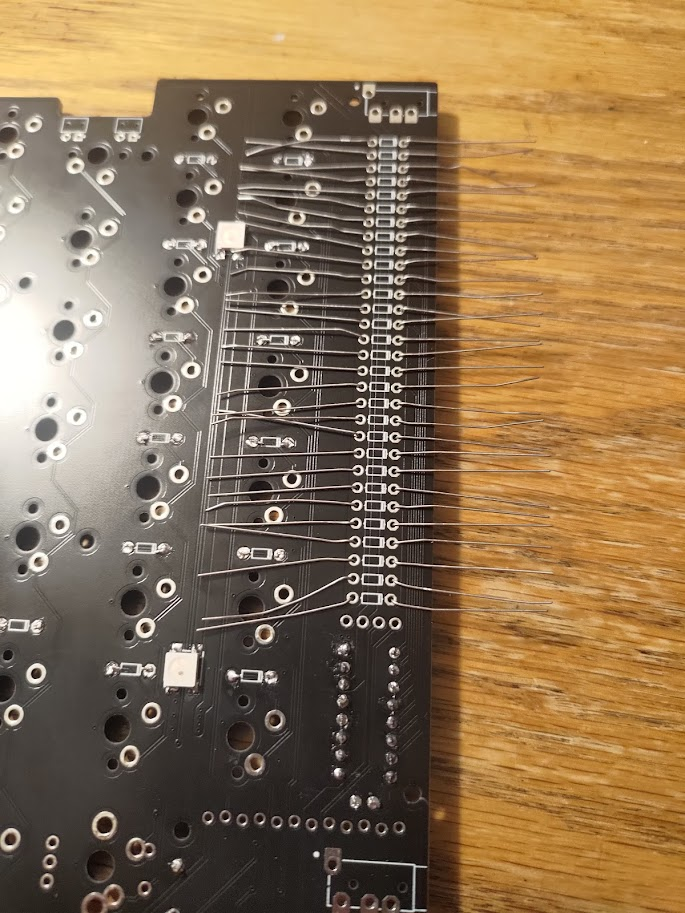
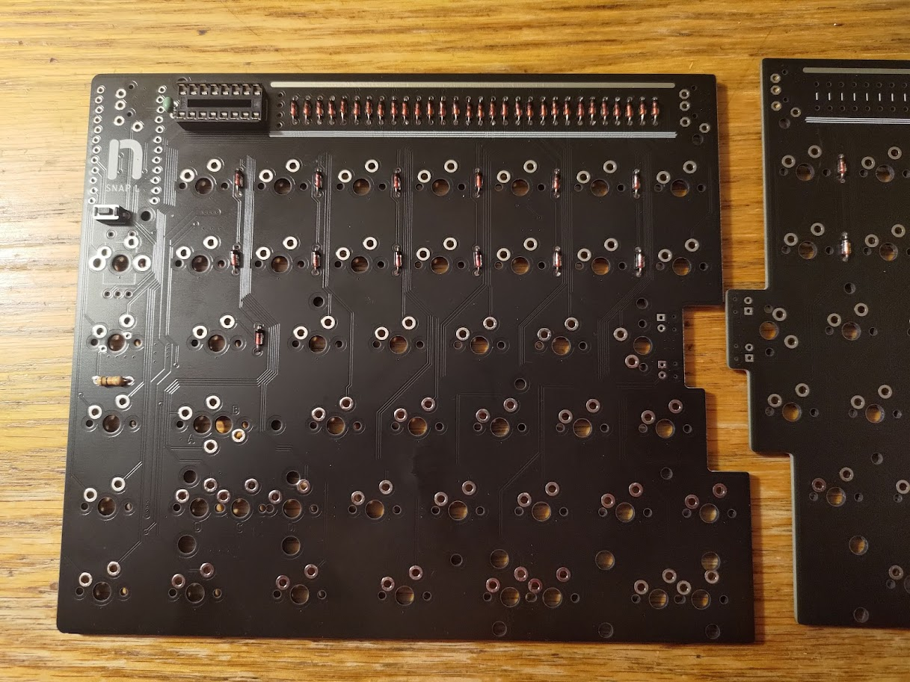
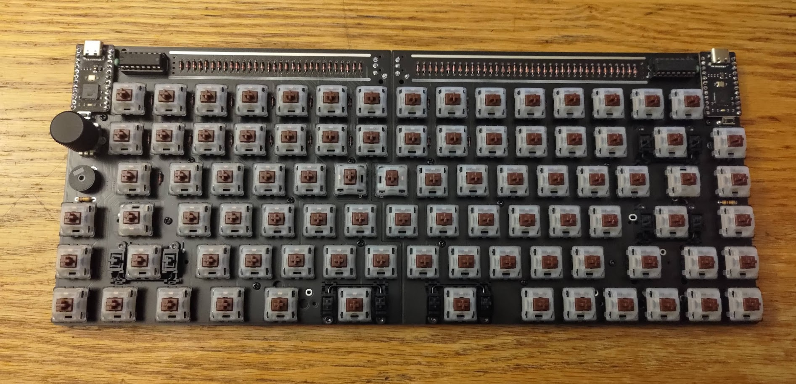
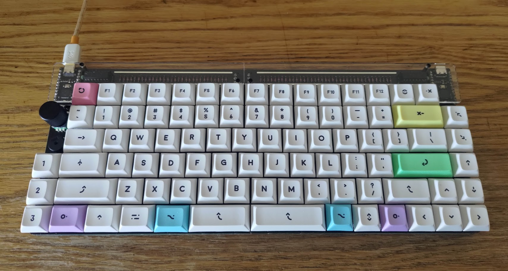

# Building my keyboard

## Background

The SNAP is a 75% split keyboard kit offered by nullbits. I chose this board for a number of reasons:

* Size

  I think a 75% layout is a great balance between small size and key count. All the keys I'd consider important are present without needing to use function layers: the F keys, arrow keys, home/end, and page up/down fit comfortably on the board. The layout eschews the numpad, which I hardly ever use even when I have one, and it keeps keys together such that there aren't separate clusters like on the standard TKL layout. Overall, this offers great compactness while giving up little in the way of functionality.

* Flexibility

  While a split form factor was more of a nice-to-have than a need-to-have for me, I appreciate the option for its ergonomic advantages. However, I'm fairly used to traditional form factors, and I wanted something that I could easily use without having to overcome a mountain of muscle memory. The SNAP seemed pretty optimal for my situation: it offers the option of splitting into two halves with the ability to recombine into a (mostly) standard layout keyboard. Plus, pogo pins on the side mean that you don't even need to use a connecting cable when the two halves are right next to each other.

* Customizability

  I wanted a keyboard that I could customize. From having an Escape key in the Caps Lock space to specifying the function layer, I appreciate the ability to change a keyboard to behave exactly as I'd like it to. The SNAP can be reprogrammed using QMK, a firmware distribution designed to power keyboards: changing the layout, knob behavior, or lighting pattern is just a matter of editing a C file, compiling, and flashing both halves.

## Parts list

| Component | Quantity | Price |
| :--- | ---: | ---: |
| SNAP Kit | 1 | $100 |
| Bit-C Pro Micro | 2 | $40 |
| Durock Stabilizers | 1 | $29 |
| Mill-Max 0305 Sockets | 200 | $20 |
| Gateron Browns 5-pin | 100 | $30 |
| DSA Milkshake Keycaps | 1 | $85 |
| USB C-to-A Cable | 1 | $4 |

Most of these are pretty self explanatory, so I'll just mention my rationale behind a few choices.

### Switches

When I first started planning this build, I was initially set on Cherry MX Brown switches because I thought that they were the only reputable option. However, I found out that Gateron switches are actually fairly well-liked in the mechanical keyboard community: people seemed to find their Browns to be smoother than Cherry's, with a subtler tactile bump. The "milky top, black bottom" variant seemed to be getting the most praise, so I went with that.

### Keycaps

I hadn't really explored the keycap world before looking for parts for my SNAP, and I was surprised by the variety of key profiles and shapes. I decided to look for DSA profile keycaps for a few reasons:

* Uniform profile

  Unlike most profiles, DSA is the same height across all rows, which means that a key can be swapped with another key without any noticeable change in feel. This seemed especially convenient since I wouldn't have to worry about key height when placing my modifier keys.

* Spherical top

  Most keycaps are cylindrical, meaning they curve along one axis; on the other hand, DSA keycaps are curved along both the horizontal and vertical axes (as if molded on a sphere). I like the aesthetic of this shape, and I wanted to try it out since others had told me they really liked it for typing.

* Shorter height

  DSA keycaps are among the shortest of keycaps that aren't low profile, and I didn't really want a super tall keyboard, so this seemed like a reasonable choice.

Unfortunately, it seems like good-quality DSA keycaps are rather expensive compared to more standard profiles like Cherry or OEM. I was able to find this set after a few days of searching for something that aligned with my preferences and that included appropriately-sized modifier keys.

### Hotswap sockets

I opted to install hotswap sockets on my keyboard in case I ever need to swap out a broken switch or if my preferences happen to shift to something other than the Gateron Browns that I built with. I went with the Mill-Max 0305s since they were relatively inexpensive and because they were listed as compatible on the SNAP website. 

### Tools

This was my first build, and at the time of writing I'm currently away from home, so I also had to buy and borrow a number of things to actually build the board:

* Soldering iron
* Leaded solder
* Screwdriver
* Side-cutting wire snips
* Masking tape

## Build photos

I largely followed the SNAP build guide provided by nullbits here.

### LEDs

The first step was to solder the underglow LEDs to the underside of the top PCB. While I've soldered before, I'm certainly not terribly good at it, and I had never worked with SMT components before, so this was a bit of a challenge. Most resources online recommended using solder paste, but I didn't have access to any; instead, for each LED, I tinned the 4 pads and then taped the LED on top in the correct orientation:

| | |
| --- | --- |
|  |  |

After that, it was just a matter of touching the iron to the pad. While my LEDs aren't perfectly flush with the underside of the board, I think they ended up close enough, and the lighting works well enough for me.

### Diodes

There are ~100 diodes between the two halves of the SNAP, and soldering them was a bit of a chore. To try to streamline the process, I inserted all of the diodes by bending the leads to keep them in place. Then, I was able to solder them all in one go.

| | |
| --- | --- |
|  |  |

### Hotswap sockets

Soldering these was rather tedious: I went row-by-row, inserting 2 sockets for each key and then taping down each row once I had finished. After taping all of them in place, I flipped the board and soldered them to PCB. Once that had been done, I was able to slot my switches into place:

| | |
| --- | --- |
|  |  |

### End result

After a little more assembly of the acrylic spacers and the bottom plates, I finally popped on my keycaps, plugged the keyboard into my computer, and flashed the keymap that I had made.

| |
| --- |
|  |
|  |

## Thoughts

While I expected to spend a significant amount on this project, I was surprised by how expensive some parts were. For instance, a quality set of stabilizers cost me nearly as much as all of my keyswitches. I also didn't realize that keycaps would be as costly as they were in my case (though there are a number of cheaper options if one is willing to go with different profiles). Furthermore, the build process was time-consuming: I spent somewhere in the neighborhood of several hours assembling the keyboard, and my own soldering skills frankly aren't a match for the mechanized processes of pre-built models.

Nevertheless, I'm glad that I built my own keyboard despite the aforementioned factors. Even though the whole affair was quite expensive, I don't think I could have achieved the same sort of feature set, customizability, and aesthetic appeal for a similar price by going with a pre-built. Plus, if I ever build another board in the future, the practice that I gained from this experience will certainly be valuable at that time.
